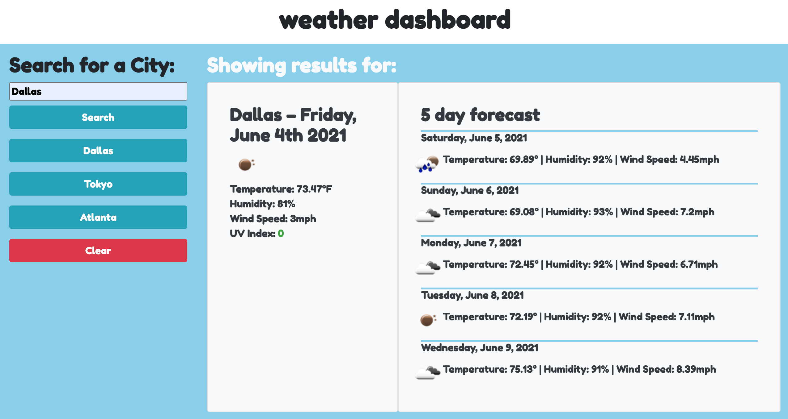

# weatherapp# Site Preview

## About

  A User is able to search the site for weather data in different cities and recieve weather information across multiple APIs within one page. The site also stores recently searched cities and allows for easy recall of the weather information for these cities. The current forecast displays the UV index for the current time of the city in a color coded range for low, medium, and high UV index values. The clear button beneath the function deletes the recently search cities from the history. 
  
  The site may be accessed at: [its GitHub page url](https://anth8nyc.github.io/weatherapp/)
